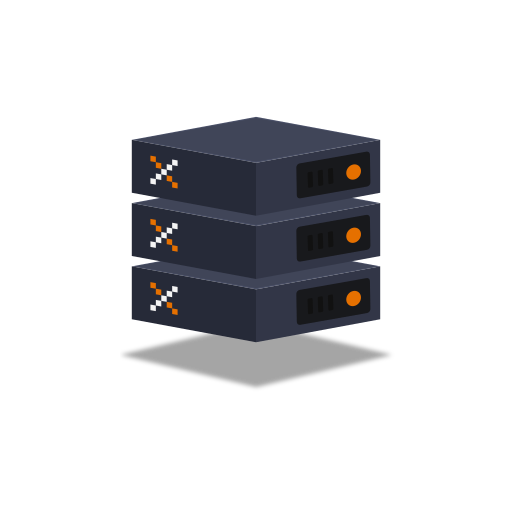

# homelab-ops

Everything needed to run, back up, and rebuild a Proxmox-based homelab from scratch.

The setup is built around two goals:
- **Ephemeral VMs** — docker host VMs are disposable. Stacks are backed up weekly to a NAS and can be fully restored into a fresh VM clone in minutes.
- **Ephemeral Proxmox host** — the host itself is reproducible. The VM template is built with Packer, and the host configuration is documented (and eventually scripted) so the whole thing can be rebuilt without relying on memory or tribal knowledge.

## Layout

```
homelab-ops/
├── packer/
│   └── lando-calrissian/       ← builds the docker-host VM template on Proxmox
├── scripts/
│   ├── restore-stacks     ← run on Proxmox host: clone VM + trigger restore
│   ├── homelab-backup     ← installed in VM: weekly backup to NAS
│   └── homelab-restore    ← installed in VM: restore stacks from NAS on first boot
├── docs/
│   ├── proxmox-host-setup.md
│   ├── vm-template-packer.md
│   ├── vm-template-manual.md
│   ├── vm-operations.md
│   └── backup-restore.md
├── .env.example
```

## How It Works

**Normal operation:** `homelab-backup` runs weekly via cron on the docker host VM. It stops each stack, tars the entire folder (compose file + bind-mounted data), copies it to the NAS, and restarts the stack.

**Disaster recovery:** Run `restore-stacks` on the Proxmox host. It clones a fresh VM from the `lando-calrissian` template, injects a cloud-init snippet that triggers `homelab-restore` on first boot, and starts the VM. The VM mounts the NAS, extracts the latest backup, and brings every stack back up — no manual steps.

**Template rebuild:** Run `packer build` in `packer/lando-calrissian/`. Packer provisions a fresh Debian cloud image with Docker, Tailscale, and NAS clients baked in, then registers it as a Proxmox template.

## Requirements

### Tools

| Tool | Where needed | Install |
|---|---|---|
| `packer` | Local machine | [packer.io](https://packer.io) |
| `ssh` | Local machine | standard on macOS/Linux |
| `git` | Local machine | standard |
| `qm` | Proxmox host | ships with Proxmox VE |

### Proxmox Host

- Proxmox VE installed — see [docs/proxmox-host-setup.md](docs/proxmox-host-setup.md)
- LVM-thin storage pool configured (e.g. `data`)
- Network bridge configured (e.g. `vmbr0`)
- Snippets storage enabled (see [proxmox-host-setup.md](docs/proxmox-host-setup.md))
- A Proxmox API token with VM create/configure permissions (used by Packer)

### Network

- A NAS share (NFS) reachable from all VMs on the local network
- DHCP on your local network (VMs get IPs automatically via cloud-init)

### Keys and Credentials

| Credential | Used for | Where it lives |
|---|---|---|
| SSH keypair | SSHing into VMs from your local machine | Public key baked into the VM template; private key in `~/.ssh/` locally |
| Proxmox API token | Packer authenticating to Proxmox to build the template | `packer/lando-calrissian/vars.pkrvars.hcl` (gitignored) |
| SSH public keys URL | SSHing into each new VM after it's restored | `SSH_KEYS_URL` in `.env` (e.g. `https://github.com/your-username.keys`); fetched and injected by `restore-stacks` |
| Tailscale auth key | Automatic VPN enrollment on first boot of each new VM | `TAILSCALE_AUTH_KEY` in `.env` (gitignored); injected into the cloud-init snippet by `restore-stacks` |

## Getting Started

If you're setting up from scratch, read the docs in this order:

1. [docs/proxmox-host-setup.md](docs/proxmox-host-setup.md) — install and configure the Proxmox host
2. [docs/vm-template-packer.md](docs/vm-template-packer.md) — build the VM template with Packer
3. [docs/backup-restore.md](docs/backup-restore.md) — set up backups and verify a restore works

For day-to-day VM operations and optional extras (USB passthrough, resizing): [docs/vm-operations.md](docs/vm-operations.md).

If you can't use Packer, the manual template path is in [docs/vm-template-manual.md](docs/vm-template-manual.md).

## Docs

- [docs/proxmox-host-setup.md](docs/proxmox-host-setup.md) — installing Proxmox VE on plain Debian 13, host configuration, storage and network setup
- [docs/vm-template-packer.md](docs/vm-template-packer.md) — building `lando-calrissian` with Packer (preferred, reproducible)
- [docs/vm-template-manual.md](docs/vm-template-manual.md) — building `lando-calrissian` manually via cloud image + virt-customize (fallback)
- [docs/vm-operations.md](docs/vm-operations.md) — cloning, resizing, when to modify in place vs. rebuild, USB/Bluetooth passthrough
- [docs/backup-restore.md](docs/backup-restore.md) — day-to-day usage of the backup and restore scripts, disaster recovery walkthrough
